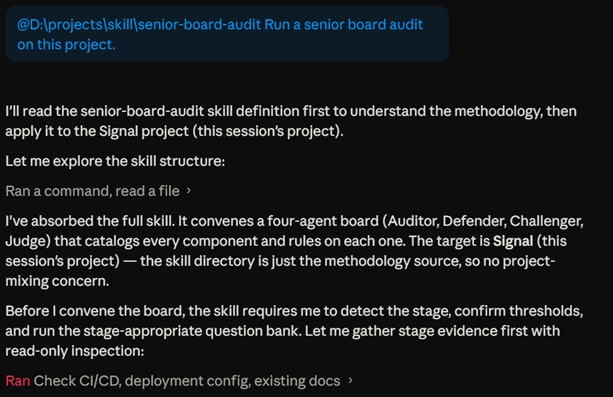
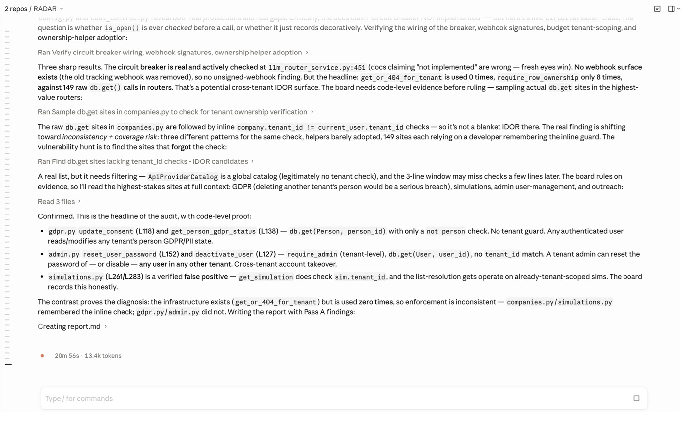
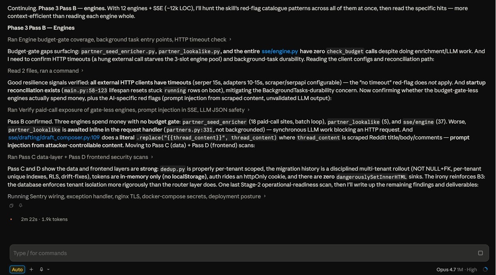

# Senior Board Audit

> A surgical code audit skill for Claude Opus and other coding agents. Four senior engineering agents convene as a board, debate every component in your codebase, and issue a written ruling.

[](https://opensource.org/licenses/MIT)
[](https://augmex.io)
[](https://claude.com)


<p align="center">
  
  <br>
  <em>Invoking the skill on a real project.</em>
</p>


---

## What this is

A Claude skill that runs a four-agent adversarial audit of any codebase. Designed for use with Claude Opus or any coding agent that can read files, query databases, and reason across multiple passes.

Instead of a single agent giving you a friendly review, you get a board:

- **The Auditor** runs the show. Catalogs every component. Orchestrates the debate.
- **The Defender** argues the current code is fine. Names its strengths.
- **The Challenger** argues the code is wrong, fragile, or redundant. Proposes alternatives.
- **The Judge** rules on the debate. Hands down a verdict with severity.

The audit adapts to your project stage. Pre-coding gets architectural questions. Mid-project gets bottleneck and resilience checks. Pre-ship gets deployment safety and rollback testing.

---

## Why this exists

Most code reviews suffer from one of two failures: they are too polite (the reviewer rubber-stamps to avoid friction) or too unstructured (the reviewer flags 50 nits without ranking them). Either way, you finish the review knowing less than you should about what is actually risky.

This skill borrows from how surgeons, pilots, and financial auditors handle high-stakes review: convene a board, force the disagreement onto the record, and require a verdict.

The result is an audit that is harder to ignore than a code review, more specific than a "best practices" checklist, and more useful than a vibes-based "looks good to me."

---

## What you get

When the audit runs, you receive five files in `docs/audit/{date}/`:

1. **`report.md`** - the headline report. Executive summary, findings by severity, recommended action plan.
2. **`inventory.md`** - every component cataloged.
3. **`dependency-map.md`** - dependency graph with circular dependency flags and orphan detection.
4. **`challenge-rounds.md`** - side-by-side comparisons for your top 5 issues, with proposed alternatives.
5. **`unanswered-questions.md`** - questions you could not answer (often the most useful file).

Every component in your codebase gets a verdict: KEEP AS IS, REFACTOR, REWRITE, DELETE, or SPLIT. Every verdict gets a severity: BLOCKER, MAJOR, MINOR, or NOTE.

---

## How to install

### Option A: Claude Code

1. Clone this repo or download `skill/SKILL.md`.
2. Copy it to your project's skills directory (typically `.claude/skills/senior-board-audit/SKILL.md`).
3. Run any of the trigger phrases listed below.

### Option B: Claude.ai with Skills enabled

1. Download `skill/SKILL.md`.
2. Add it as a custom skill in your Claude settings.
3. Invoke from any conversation.

### Option C: Any coding agent that supports Markdown-based skills or system prompts

1. Copy the contents of `skill/SKILL.md`.
2. Add it to your agent's system prompt or skill configuration.
3. Trigger with the phrases below.

---

## How to use

The skill triggers on any of these phrases:

- "Run a senior board audit on this project."
- "Audit the codebase."
- "Find the loopholes."
- "Is this ready to ship?"
- "Senior review."
- "We're about to launch, run the board."

The skill will:

1. Detect your project stage by scanning the repo.
2. Ask you to confirm the stage (pre-coding, mid-project, or pre-ship).
3. Run the stage-appropriate question bank (typically 9 to 15 questions).
4. Catalog every component in the codebase.
5. Build a dependency map.
6. Walk through every component with the four-agent board.
7. Run a deeper challenge round on the top 5 issues.
8. Write the final report.

Plan for 15 to 45 minutes of agent time for a small to medium codebase. Larger systems can take several hours. The agent will work autonomously after the initial questions.

---

## What it looks like in action

The board works through the codebase in phases, building evidence before issuing verdicts. It cross-checks documentation against live code, samples real call sites, and is willing to record honest false positives.

<p align="center">
  
  <br>
  <em>The board hunting cross-tenant IDOR risks. Note the honest false-positive admission on simulations.py.</em>
</p>

The audit runs over multiple passes, scanning different layers of the system before consolidating findings.

<p align="center">
  
  <br>
  <em>Phase 3 passes across engines, data layer, and frontend.</em>
</p>


---

## What it audits

### Code level

- Functions over 50 lines, files over 500 lines, classes over 300 lines
- Duplicate logic across files
- Confusing or inconsistent patterns
- Code that does too many things at once
- Cyclomatic complexity hotspots
- Magic numbers, dead code, stale TODOs

### Security

- SQL injection vectors
- Hardcoded secrets
- Authentication and authorization gaps
- PII leaks in logs
- Weak crypto
- CSRF, SSRF, XSS, and open redirect risks
- Insecure file uploads

### Performance

- N+1 queries
- Missing or misordered indexes
- Synchronous external calls on hot paths
- Cache invalidation bugs
- Connection pool leaks
- Unbounded queries and loops

### Resilience

- Missing timeouts on external calls
- No circuit breakers or rate limiters
- Retry storms without backoff
- Non-idempotent workers
- Race conditions in concurrent writes

### Observability

- Silent error swallowing
- Logs without trace IDs
- Metrics nobody can name
- Alerts that never fire or fire constantly

### AI-specific (for products with LLM integrations)

- LLM calls without cost caps
- LLM output written to databases without validation
- LLM tool calls without a whitelist
- Hardcoded model names
- No fallback when the primary provider fails
- Prompt injection vectors

### Deployment (Pre-ship stage only)

- Rollback plan and rollback timing
- Database migration safety
- Backup verification
- Auto-scaling rules
- Load test results
- On-call rotation
- Secret rotation

---

## Project stages

The skill behaves differently at each stage.

### Stage 0. Pre-coding (Blueprint)

You have an idea, a spec, or a few skeleton files. No real implementation yet. The board audits your assumptions, not your code.

Sample questions:
- What is the expected user base in 6 months and 2 years?
- Does this system favor consistency or availability?
- Which compliance regulations apply?

### Stage 1. Mid-project (Development)

The project has working code but is not yet production-bound. The board hunts bottlenecks, edge cases, and code smells before they ossify.

Sample questions:
- Where is the current data bottleneck?
- What happens if a downstream third-party API drops?
- Are asynchronous workers idempotent?

### Stage 2. Pre-ship (Launch Readiness)

The project is feature-complete. The board stress-tests deployment safety, rollback paths, and security posture.

Sample questions:
- What is the exact rollback plan?
- Is the rollback backward-compatible with the new database schema?
- Are all secrets rotated and vaulted?

---

## Example output

A trimmed excerpt from a real audit report:

```markdown
## Findings by severity

### Blockers (must fix before next stage)

#### api/routes/checkout.py - Payment without order record
Verdict: REFACTOR | Severity: BLOCKER

The checkout flow charges the user before creating the order record. If
inventory reservation fails after payment succeeds, the system has taken
money without recording a sale. There is no idempotency key, so a retry
charges twice.

Recommended fix:
1. Add idempotency key on the inbound request.
2. Wrap payment and order creation in a database transaction with
   payment as the last step.
3. Move email send to a background job triggered by the order creation.

### Major (should fix soon)

#### services/embedding_service.py - N+1 query in retrieval loop
Verdict: REFACTOR | Severity: MAJOR
...
```

See `examples/example-audit-report.md` for a complete sample.

---

## What this skill is NOT

- **Not a linter.** It catches things linters miss (architectural mistakes, business logic bugs, dependency tangles). It does not replace your linter for style enforcement.
- **Not a vulnerability scanner.** It flags security smells, but it does not replace tools like Snyk, Semgrep, or Burp Suite for systematic security testing.
- **Not a code generator.** The board proposes alternatives but does not implement them. You decide what to do with the verdicts.
- **Not a substitute for human review.** It is a tool to make human review sharper, not to replace it.

---

## Roadmap

Planned for future releases:

- A Stage 3 (Post-ship) variant focused on incident retrospectives and tech debt prioritisation.
- Integration with GitHub Actions to run a lightweight audit on every pull request.
- Project-type presets (SaaS web app, mobile backend, AI product, e-commerce, internal tool) with tuned question banks.
- A "follow-up audit" mode that compares against a previous audit and tracks which findings were resolved.
- A "team audit" mode where multiple developers can submit responses and the board reconciles them.

Contributions welcome on any of these.

---

## Contributing

We welcome contributions. See [CONTRIBUTING.md](CONTRIBUTING.md) for the full guide.

Quick version:
1. Fork the repo.
2. Create a feature branch.
3. Make your change.
4. Open a pull request with a clear description.

Areas where help is especially welcome:
- Stage-specific question banks for niches we haven't covered (game backends, embedded systems, data pipelines, etc).
- Red flag patterns for languages and frameworks beyond the current Python/JavaScript/PHP focus.
- Worked examples showing the four-agent debate on real code.
- Translations of the SKILL.md into other languages.

---

## License

MIT License. See [LICENSE](LICENSE).

You are free to use this skill in commercial projects, modify it, distribute it, and build on it. We only ask that you keep the attribution to Augmex Technologies in derivative works.

---

## Credits

Built and maintained by [Augmex Technologies Limited](https://augmex.io), an AI-first software development company based in Dhaka, Bangladesh.

The four-agent board structure draws on adversarial review practices from medicine, finance, and aviation. The audit philosophy draws on Peter Naur's 1985 paper *Programming as Theory Building*, which remains the foundational text on what software actually is and where it actually lives.

If this skill saves your team from a 3 AM incident, that is the only success metric we care about.

---

## Contact

- **Project issues:** [GitHub Issues](../../issues)
- **Augmex Technologies:** [augmex.io](https://augmex.io) | hello@augmex.io
- **Maintainer:** [@augmex](https://github.com/augmex)

For security disclosures, see [SECURITY.md](SECURITY.md).
